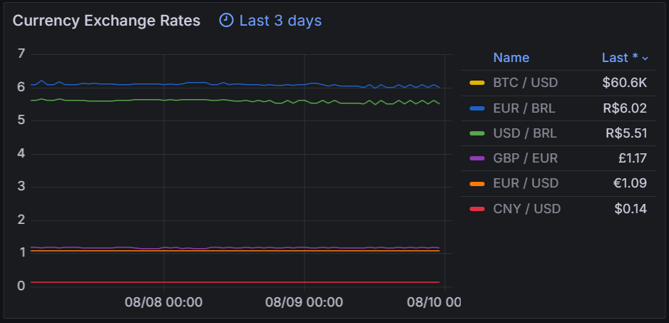

# Currency Exporter 💱📈

## Overview 📊

This script collects and exports real-time exchange rates for various currency pairs to Prometheus. Using the AwesomeAPI, it retrieves the latest exchange rates and makes them available for monitoring in Prometheus, which can then be visualized in Grafana.

<div align="center">
   
</div>

## Features 🌟
   
   - **Exchange Rate Collection:** Fetches real-time exchange rates from the AwesomeAPI for a configurable list of currency pairs.
   
   - **Prometheus Integration:** Provides metrics in a format compatible with Prometheus scraping.
   
   - **Flexible Configuration:** Easily configurable to include the currency pairs you are interested in via a `config.yaml` file.
   
   - **Efficient Performance:** Designed to handle multiple currency pairs with minimal resource usage.

## Configuration ⚙️

1. **API Configuration:**

   Update the `config.yaml` file with the currency pairs you want to monitor. The format used is `BASE_CURRENCY-TARGET_CURRENCY`, where:

   - **BASE_CURRENCY** is the currency you are converting from.
   - **TARGET_CURRENCY** is the currency you are converting to.

   Each currency pair should be separated by a hyphen. For example, to get the exchange rate from US Dollars (USD) to Brazilian Reais (BRL), you would use `USD-BRL`.

   Example `config.yaml`:
   
      ```yaml
   currencies:
     - USD-BRL
     - EUR-BRL
     - GBP-BRL
      ```
   In this example:
   
   - `USD-BRL` retrieves the exchange rate from US Dollars to Brazilian Reais. 
   
   - `USD-BRL` retrieves the exchange rate from US Dollars to Brazilian Reais.
   
   - `USD-BRL` retrieves the exchange rate from US Dollars to Brazilian Reais.

2. **Exporter Port (Optional):**

   Set the port for the Prometheus exporter in the script:
   
   ```python
   PORT = 7575
   ```

## Usage 🚀

1. **Install Dependencies:**

   Install the required Python packages:
   
   ```sh
   pip install requests prometheus_client pyyaml
   ```

2. **Run the Script:**

   Launch the script to start the Prometheus exporter:
   
   ```sh
   python currency_exporter.py
   ```

3. **Access Metrics:**

   ```init
   http://localhost:7575/metrics
   ```

# Notes 📝

   - **Currency Pairs:** Ensure that the currency pairs in `config.yaml` follow the format `BASE_CURRENCY-TARGET_CURRENCY`, where each currency is represented by its standard ISO code. For example, `USD-BRL` is for US Dollars to Brazilian Reais.
     
   - **API Limitations:** Be aware of any rate limits or restrictions imposed by the AwesomeAPI.

# License

This project is licensed under the MIT License.

