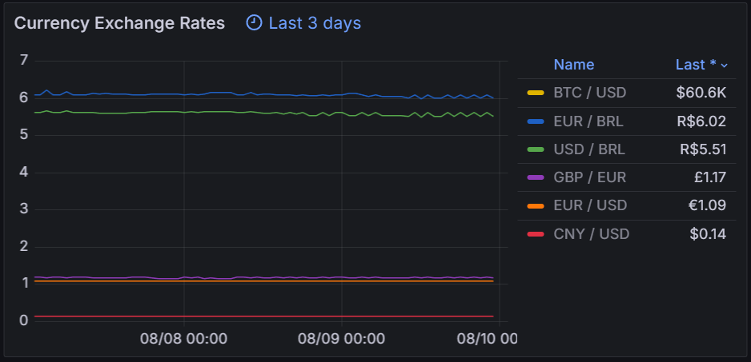
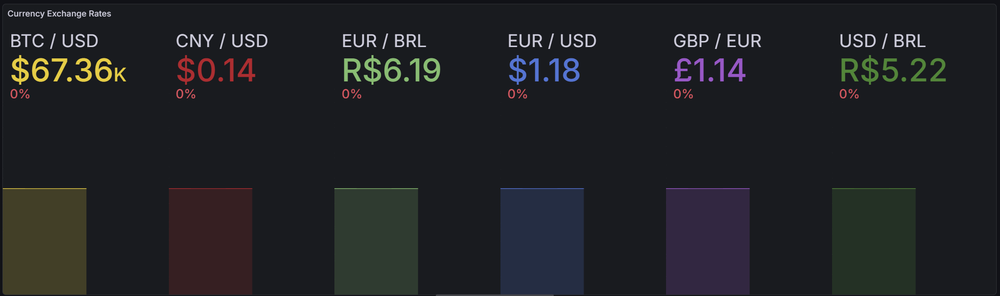

<h1 align="center">Currency Exporter 💱</h1>

<h3 align="center"> Prometheus exporter for currency exchange rates.</h3>

<p align="center">It fetches rates from a public dataset on an interval and exposes metrics on `/metrics`.</p>
<p align="center">This exporter is for monitoring and dashboards. It is not for trading or real time pricing.</p>

## Examples (Grafana)

These screenshots are examples.

### Time series panel

<p align="center">
  
</p>

### Stat panel

<p align="center">
  
</p>

## How it works

- You define the currency pairs in `config.yaml` (example: `EUR-USD`, `USD-BRL`).
- The exporter chooses a pivot currency (it prefers `USD` if it appears in your pairs).
- It downloads **one** JSON snapshot for the pivot currency and builds a lookup table of rates.
- Each configured pair is calculated from the snapshot using cross rate math.
- Prometheus scraping does not trigger extra API calls. The exporter serves cached values until the next update cycle.

If a currency code does not exist in the snapshot (example: `ABC-USD`), the exporter stays up, but marks the pair as unsupported.

## Features 📊

- Metrics on `/metrics`
- Pair based config in `config.yaml`
- One snapshot request per update cycle
- Cached results (Prometheus scrapes are cheap)
- Retries with exponential backoff for temporary network issues
- Health and config metrics for alerting
- Optional default Python and process metrics (`expose_default_metrics`)

## Data source

- Project: https://github.com/fawazahmed0/exchange-api  
- Symbols list (all supported codes):  
  https://cdn.jsdelivr.net/npm/@fawazahmed0/currency-api@latest/v1/currencies.json

The upstream dataset updates daily. Updating more frequently than 24h will usually return the same values.  
Your exporter update frequency is controlled by `update_interval_seconds`.

## Requirements

- Python 3.10+ (3.11 recommended)  
- Or Docker  
- Network access to the data source

## Install ⚙️

Before running, edit `config.yaml` and set the currency pairs you want in `pairs:`.  
This repository includes a `config.yaml` example. It is not meant to be used as-is.

### Python 🐍

Install dependencies:

```bash
pip install -r requirements.txt
```

Run:

```bash
python currency_exchange_exporter.py
```

Test:

```bash
curl http://localhost:9131/metrics
```

### Docker 🐳 (GHCR)

Pull:

```bash
docker pull ghcr.io/luizbizzio/currency-exchange-exporter:latest
```

Run (mount your `config.yaml`):

```bash
docker run -d   --name currency-exchange-exporter   -p 9131:9131   -v "$(pwd)/config.yaml:/config/config.yaml:ro"   --restart unless-stopped   ghcr.io/luizbizzio/currency-exchange-exporter:latest   --config-file /config/config.yaml
```

Test:

```bash
curl http://localhost:9131/metrics
```

Notes:
- If you change `server.port` in `config.yaml`, update the `-p` mapping too.
- The container is stateless. Any config change requires a container restart.

## Configuration 🛠️

Edit `config.yaml`:

```yaml
server:
  port: 9131
  timeout_seconds: 10
  update_interval_seconds: 28800
  retries: 3
  retry_backoff_seconds: 1
  expose_default_metrics: false
  log_level: INFO

pairs:
  - BTC-USD
  - EUR-BRL
  - USD-BRL
  - GBP-EUR
  - EUR-USD
  - CNY-USD
```

Notes:
- Pair format is `BASE-QUOTE` like `USD-BRL`.
- If a code does not exist, the exporter will set:
  - `currency_pair_supported = 0`
  - `currency_exporter_config_invalid_pairs > 0`

## Prometheus scrape config

```yaml
scrape_configs:
  - job_name: "currency-exchange-exporter"
    static_configs:
      - targets: ["YOUR_EXPORTER_IP:9131"]
```

Tip:
If you update once per day, increase `scrape_interval` for this job (example: 1h) to reduce storage and noise.

## Grafana queries

Single pair:

```promql
currency_exchange_rate{base="EUR",quote="USD"}
```

Many pairs in one panel:

```promql
currency_exchange_rate{base=~"EUR|USD|GBP|CNY|BTC",quote=~"USD|EUR|BRL"}
```

Legend format:

`{{base}}-{{quote}}`

## Metrics

| Name | Type | Description |
|---|---|---|
| `currency_exchange_rate{base,quote}` | Gauge | Exchange rate from base to quote |
| `currency_pair_supported{base,quote}` | Gauge | 1 if pair is supported in current snapshot, else 0 |
| `currency_exporter_up` | Gauge | 1 if last update succeeded, else 0 |
| `currency_exporter_last_update_timestamp` | Gauge | Unix timestamp of last update attempt |
| `currency_exporter_last_success_timestamp` | Gauge | Unix timestamp of last successful update |
| `currency_exporter_update_duration_seconds` | Gauge | Duration of last update |
| `currency_exporter_errors_total` | Counter | Total number of update errors |
| `currency_exporter_config_invalid_pairs` | Gauge | Number of configured pairs missing in snapshot |
| `currency_exporter_invalid_pairs_total` | Counter | Number of update cycles that had missing pairs |
| `currency_exporter_snapshot_info{date,pivot}` | Gauge | Snapshot date and pivot info |

## Troubleshooting 🔍

If you do not see `currency_exchange_rate`:
- Open `/metrics` and search for `currency_`.
- Confirm the exporter is running on the expected port.
- Check logs. A bad URL or timeout will set `currency_exporter_up = 0`.

If `currency_exporter_config_invalid_pairs > 0`:
- One or more codes in `pairs` do not exist in the current snapshot.
- Check the symbols list:
  https://cdn.jsdelivr.net/npm/@fawazahmed0/currency-api@latest/v1/currencies.json

## License

This project is licensed under the [Apache License 2.0](./LICENSE).
